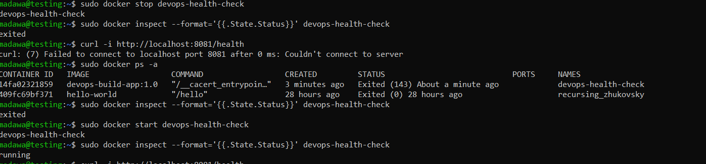
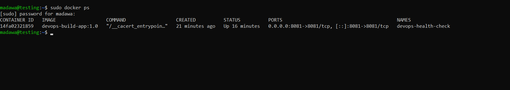
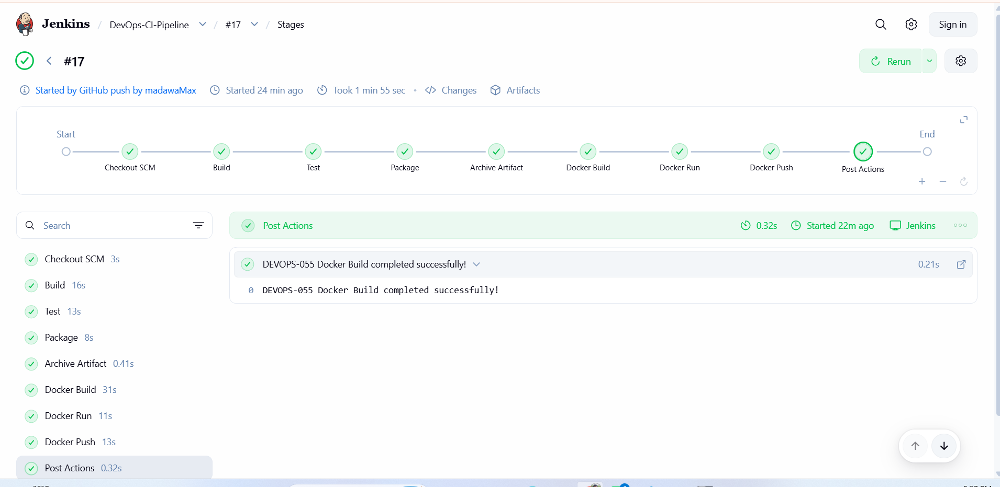
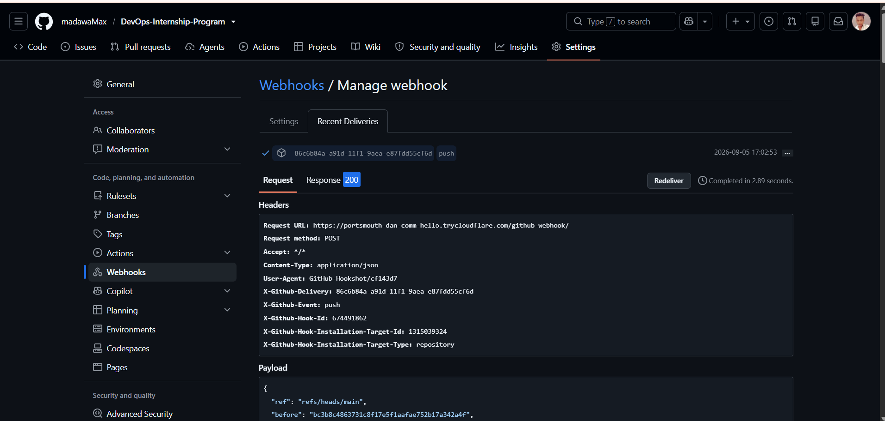
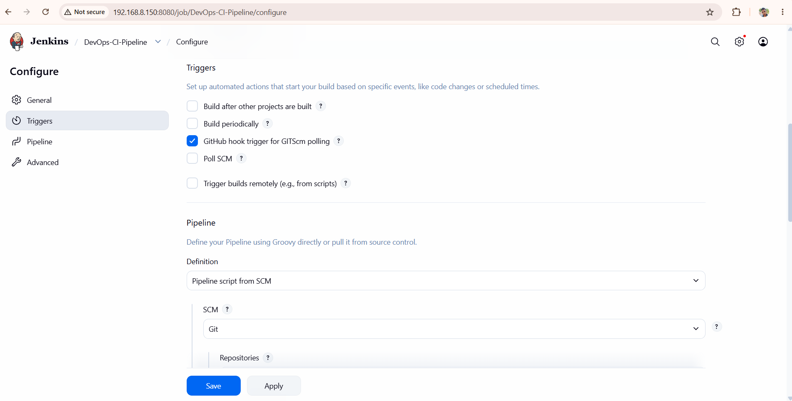
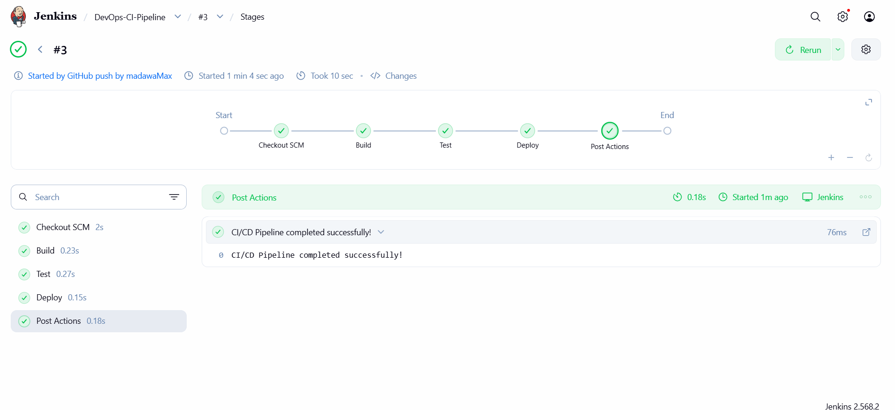
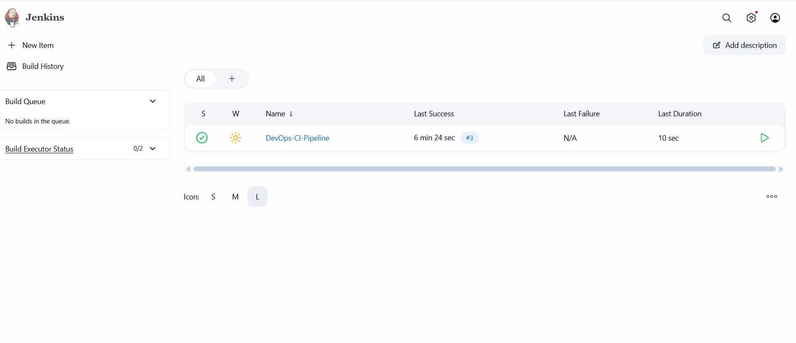
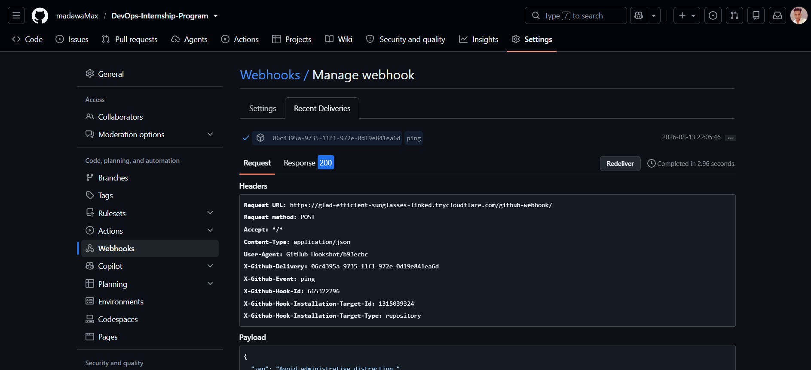
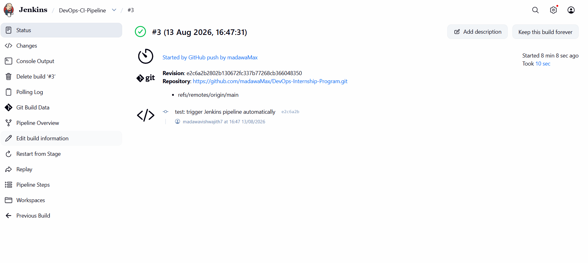
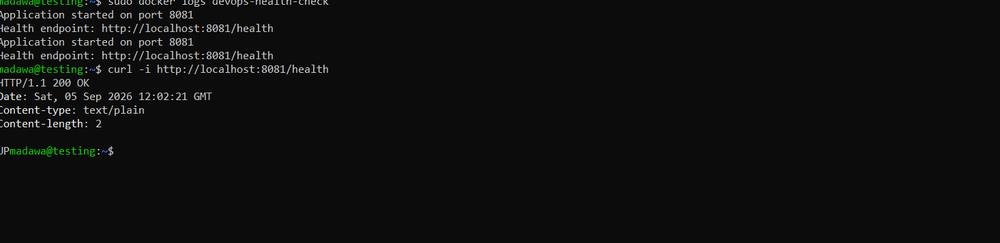

# DEVOPS-054 – Jenkins CI/CD Pipeline & Monitoring

##  Project Overview

This project is a practical DevOps project focused on implementing a CI/CD pipeline using Jenkins, GitHub, Docker, Docker Hub, and basic application monitoring.

The project demonstrates how a developer's code change can automatically trigger a Jenkins pipeline through a GitHub Webhook and progress through build, test, packaging, containerization, deployment, and health-check stages.

The overall workflow is:

```text
Developer
    ↓
GitHub Repository
    ↓
GitHub Webhook
    ↓
Cloudflare Tunnel
    ↓
Jenkins
    ↓
Maven Build
    ↓
Unit Test
    ↓
Package JAR
    ↓
Docker Build
    ↓
Docker Run
    ↓
Docker Hub
    ↓
Application
    ↓
Health Check
    ↓
Monitoring
    ↓
Failure Detection
    ↓
Troubleshooting
    ↓
Recovery
    ↓
Healthy Application
```

---

#  Objectives

- Create a Java 21 Maven application
- Configure the Maven project structure and dependencies
- Add JUnit 5 unit testing
- Verify the Maven build locally
- Integrate the application with Jenkins
- Configure a Jenkins Pipeline using a `Jenkinsfile`
- Automatically checkout source code from GitHub
- Compile the Java application using Maven
- Execute automated unit tests
- Package the application as an executable JAR
- Archive the generated JAR artifact in Jenkins
- Download and execute the archived artifact
- Build a Docker image
- Run the application inside a Docker container
- Push the Docker image to Docker Hub
- Configure a GitHub Webhook for automatic Jenkins triggering
- Implement an HTTP health endpoint
- Monitor Docker container status and application logs
- Detect application/container failure
- Troubleshoot the failure
- Recover the application
- Verify the final healthy state

---

# 🛠 Technologies Used

| Technology | Purpose |
|---|---|
| Ubuntu Server 24.04 | Jenkins and Docker server environment |
| Jenkins | CI/CD pipeline automation |
| Git | Version control |
| GitHub | Source code repository |
| GitHub Webhook | Automatic Jenkins build trigger |
| Cloudflare Tunnel | Temporary public access for GitHub webhook |
| Java 21 | Application and Jenkins runtime |
| Apache Maven 3.9.16 | Build and dependency management |
| JUnit 5 | Automated unit testing |
| Docker | Application containerization |
| Docker Hub | Container image registry |
| Bash | Linux server command-line operations |
| curl | HTTP health-check testing |

---

#  Architecture

```text
                         Developer
                             │
                             ▼
                     GitHub Repository
                             │
                      GitHub Webhook
                             │
                             ▼
                    Cloudflare Tunnel
                             │
                             ▼
                       Jenkins Server
                    Ubuntu Server 24.04
                      192.168.8.150:8080
                             │
                             ▼
                    Jenkins CI/CD Pipeline
                             │
          ┌──────────────────┼──────────────────┐
          │                  │                  │
          ▼                  ▼                  ▼
      Checkout             Build              Test
          │                  │                  │
          └──────────────────┼──────────────────┘
                             ▼
                         Package JAR
                             │
                             ▼
                      Archive Artifact
                             │
                             ▼
                       Docker Build
                             │
                             ▼
                        Docker Run
                             │
                             ▼
                        Docker Hub
                             │
                             ▼
                     Running Application
                             │
                             ▼
                     HTTP /health Endpoint
                             │
                             ▼
                       Health Check
                             │
                             ▼
                   Container Monitoring
                             │
                 ┌───────────┴───────────┐
                 │                       │
              Healthy                 Failure
                 │                       │
                 ▼                       ▼
                UP                 Troubleshooting
                                         │
                                         ▼
                                      Recovery
                                         │
                                         ▼
                                  Final Health Check
                                         │
                                         ▼
                                        UP
```

---

#  Project Structure

```text
06-CI-CD/
│
├── README.md
├── TASK.md
├── COMMANDS.md
├── Jenkinsfile
├── Dockerfile
│
├── screenshots/
│   ├── docker-container-running.png
│   ├── failure-detection.png
│   ├── docker-container-recovery.png
│   ├── health-check-success.png
│   ├── github-webhook-success.png
│   └── jenkins-build-success.png
│
└── app/
    ├── pom.xml
    │
    └── src/
        ├── main/
        │   └── java/
        │       └── com/
        │           └── devops/
        │               └── App.java
        │
        └── test/
            └── java/
                └── com/
                    └── devops/
                        └── AppTest.java
```

---

#  CI/CD Pipeline

The Jenkins pipeline is implemented using a `Jenkinsfile`.

## Pipeline Stages

| Stage | Description |
|---|---|
| Checkout SCM | Checks out the latest source code from GitHub |
| Build | Compiles the Java application using Maven |
| Test | Runs automated JUnit 5 tests |
| Package | Creates the executable JAR file |
| Archive Artifact | Stores the generated JAR in Jenkins |
| Docker Build | Builds the Docker image |
| Docker Run | Runs the application container |
| Docker Push | Pushes the image to Docker Hub |
| Post Actions | Displays the final pipeline result |

## Pipeline Flow

```text
Checkout SCM
      ↓
Maven Compile
      ↓
JUnit 5 Tests
      ↓
Package JAR
      ↓
Archive Artifact
      ↓
Docker Build
      ↓
Docker Run
      ↓
Docker Push
      ↓
BUILD SUCCESS
```

---

# 🔗 GitHub Webhook

A GitHub Webhook was configured to automatically notify Jenkins when a push is made to the repository.

The webhook sends a `push` event to Jenkins through the Cloudflare Tunnel.

```text
Git Push
   ↓
GitHub
   ↓
Webhook
   ↓
Cloudflare Tunnel
   ↓
Jenkins
   ↓
Automatic Build
```

The GitHub webhook delivery was successfully received with an HTTP `200` response.

### Screenshot


---

# ☁️ Cloudflare Tunnel

A Cloudflare Quick Tunnel was used to provide temporary public access to the Jenkins webhook endpoint.

Example command:

```bash
cloudflared tunnel --url http://localhost:8080
```

The generated public URL was configured in the GitHub repository webhook settings.

> Note: Cloudflare Quick Tunnels are temporary. The generated URL can change when a new tunnel is created.

---

# ☕ Java Application

The application is a simple Java 21 application.

The main application class is:

```text
app/src/main/java/com/devops/App.java
```

The application exposes its message through the application logic and provides the health endpoint when running as the containerized service.

---

#  Unit Testing

JUnit 5 is used for automated unit testing.

Test class:

```text
app/src/test/java/com/devops/AppTest.java
```

The test verifies that the application message returned by `App.getMessage()` matches the expected value.

Example command:

```bash
mvn test
```

Expected result:

```text
Tests run: 1
Failures: 0
Errors: 0
```

---

#  Maven Build

The Maven project uses Java 21.

The Maven project configuration is stored in:

```text
app/pom.xml
```

Local build verification:

```bash
mvn clean package
```

Expected result:

```text
BUILD SUCCESS
```

> Maven commands must be executed from the directory containing `pom.xml`.

For this project:

```text
06-CI-CD/app/
```

---

# 🐳 Docker

The application was containerized using Docker.

## Docker Image

The application Docker image was built successfully.

Example image:

```text
devops-build-app:1.0
```

The image was also tagged for Docker Hub:

```text
madawamax/devops-build-app:1.0
```

## Docker Build

The Jenkins pipeline performs the Docker build automatically.

```text
Dockerfile
    ↓
Docker Build
    ↓
devops-build-app:1.0
```

---

#  Docker Run

The application was started inside the following Docker container:

```text
devops-health-check
```

The application listens on port `8081`.

Port mapping:

```text
Host: 8081
Container: 8081
```

Example:

```text
0.0.0.0:8081 → 8081/tcp
```

---

#  DEVOPS-060 – Monitoring & Health Check

##  Task Objective

Implement a basic monitoring and health-check mechanism to determine whether the application is healthy or unhealthy.

---

## Health Endpoint

The application exposes the following HTTP endpoint:

```text
http://localhost:8081/health
```

The endpoint returns:

```text
HTTP/1.1 200 OK

UP
```

This confirms that the application is healthy and responding correctly.

### Screenshot


---

## 🐳 Docker Container Monitoring

The application was executed inside the Docker container:

```text
devops-health-check
```

The container status was verified using Docker commands.

Command:

```bash
sudo docker ps
```

Expected healthy state:

```text
Up
```

Example:

```text
devops-health-check
Up
0.0.0.0:8081->8081/tcp
```

### Screenshot


---

##  Docker Logs

Application logs were checked using:

```bash
sudo docker logs devops-health-check
```

The application produced:

```text
Application started on port 8081
Health endpoint: http://localhost:8081/health
```

This confirmed that the application started successfully.

---

##  Health Check Verification

The health endpoint was tested using:

```bash
curl -i http://localhost:8081/health
```

Successful result:

```text
HTTP/1.1 200 OK
Content-type: text/plain

UP
```

This confirms:

- HTTP request reached the application
- Application responded successfully
- Health endpoint is available
- Application health status is `UP`

---

#  Failure Detection Test

To verify failure detection, the Docker container was intentionally stopped.

Command:

```bash
sudo docker stop devops-health-check
```

The container state was then checked:

```bash
sudo docker inspect --format='{{.State.Status}}' devops-health-check
```

Result:

```text
exited
```

The health endpoint was tested again:

```bash
curl -i http://localhost:8081/health
```

Failure result:

```text
curl: (7) Failed to connect to localhost port 8081
```

This confirmed that the application was unavailable after the container was stopped.

### Screenshot



---

#  Troubleshooting & Recovery

After detecting the failure, the container was restarted.

```bash
sudo docker start devops-health-check
```

The container status was verified:

```bash
sudo docker inspect --format='{{.State.Status}}' devops-health-check
```

Expected result:

```text
running
```

### Screenshot



---

## Final Health Check

The health endpoint was tested again:

```bash
curl -i http://localhost:8081/health
```

Final result:

```text
HTTP/1.1 200 OK
Content-type: text/plain

UP
```

Application health status:

```text
UP
```

This confirms that the application was successfully recovered.

---

#  Monitoring Flow

```text
Application
     ↓
HTTP /health Endpoint
     ↓
Health Check
     ↓
Docker Container Monitoring
     ↓
Failure Detection
     ↓
Troubleshooting
     ↓
Container Recovery
     ↓
Health Check
     ↓
Healthy / UP
```

---

##  Screenshots

### 1. Jenkins Pipeline Overview

The complete Jenkins CI/CD pipeline was executed successfully, including Checkout SCM, Build, Test, Package, Archive Artifact, Docker Build, Docker Run, and Docker Push stages.



---

### 2. GitHub Webhook

GitHub Webhook was configured to automatically trigger the Jenkins pipeline when changes were pushed to the repository.



---

### 3. Jenkins Build

The Jenkins build was successfully triggered through the GitHub Webhook.



---

### 4. Jenkins Pipeline Stages

The Jenkins pipeline stages completed successfully.



---

### 5. Jenkins Docker Build

The Docker Build stage completed successfully.



---

### 6. Jenkins Docker Run

The Docker Run stage completed successfully and the application container was started.



---

### 7. Jenkins Docker Push

The Docker image was successfully pushed to Docker Hub.



---

### 8. Docker Container Status

The application container `devops-health-check` was running and port `8081` was mapped successfully.


---

### 9. Health Check

The `/health` endpoint returned `HTTP/1.1 200 OK` and `UP`, confirming that the application was healthy.



---

### 10. Failure Detection and Recovery

The application failure was intentionally tested by stopping the Docker container. The health check failed, after which the container was restarted and the application recovered successfully.


# 🏁 Final Result

The project successfully demonstrates a complete CI/CD and basic monitoring workflow:

```text
Developer
    ↓
GitHub
    ↓
Webhook
    ↓
Cloudflare Tunnel
    ↓
Jenkins
    ↓
Maven Build
    ↓
Unit Test
    ↓
JAR Packaging
    ↓
Docker Build
    ↓
Docker Run
    ↓
Docker Hub
    ↓
Application
    ↓
Health Check
    ↓
Monitoring
    ↓
Failure Detection
    ↓
Troubleshooting
    ↓
Recovery
    ↓
Healthy Application 
```

## Project Status

**COMPLETED**

---

#  Key DevOps Concepts Learned

Through this project, the following practical DevOps concepts were implemented:

- Continuous Integration
- Continuous Delivery fundamentals
- Jenkins Pipeline as Code
- GitHub Webhooks
- Automated build triggering
- Maven build automation
- Automated unit testing
- JAR artifact management
- Docker image creation
- Docker container execution
- Docker Hub image publishing
- Application health checks
- Container monitoring
- Failure detection
- Troubleshooting
- Application recovery
- Basic production-style monitoring workflow
